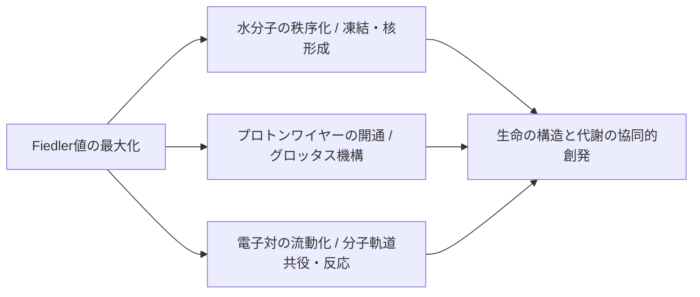

# 🌌 Fiedler値最大化に基づく生体高分子・水和ネットワークの統一トポロジー理論
## 〜 水分子の核形成、プロトンワイヤー、電子対の相補的リレー、およびそのシミュレーションアルゴリズム 〜

本ドキュメントは、「ペプチド＋水和水分子」の統合ネットワークにおけるグラフ代数的連結度（Fiedler値）の最大化が、フォールディング（構造形成）から酵素触媒反応（プロトン移動・電子対移動）に至る生命現象の本質的な駆動力であるという仮説と、それをシミュレーションするための統一アルゴリズムをまとめたものです。

---

## 1. 統一理論の全体像と核心概念

自然界（特に水中に浮かぶ生体高分子系）は、エネルギー散逸を最小化し、情報や電荷の伝播効率を最大化するような幾何学的配座を自発的に選択します。この「伝播の速さ・効率」を記述する唯一無二の数理的指標が、グラフ・ラプラシアン行列の第2最小固有値である **Fiedler値（$\lambda_2$）** です。



---

## 2. 核心概念の詳細

### ① 水分子ネットワークの構造最適化（核形成と制約伝播）
水分子はペプチドの周囲で熱力学的に揺らいでいますが、ペプチドが特定のコンフォメーションをとると、水分子同士の水素結合および水-ペプチド間の水和結合が「固定（ロック）」され、氷に似た高密度な秩序ネットワーク（溶媒ケージ）を形成します。
* **物理的意義**: 一度ロックされた水和ネットワークが「足場」として機能し、ペプチドの次の回転自由度を幾何学的に制限します。これにより、トポロジー空間の自由度が**確率的（Probabilistic）から決定論的（Deterministic）**へと転移し、長鎖ペプチドでも誤差なく天然構造へ折り畳まれます。

### ② プロトン移動（グロッタス機構）と代数的連結度の相関
水中におけるプロトンの移動は、単一イオンの物理的拡散ではなく、隣接する水分子間で共有結合と水素結合がドミノ倒しのように入れ替わる「グロッタス機構（Proton Hopping）」によって行われます。
* **数理的マッピング**: 水素結合ネットワークをグラフ $G = (V, E)$（ノード：水分子の酸素やアミノ酸極性原子、エッジ：水素結合）と定義すると、このグラフ上のプロトン拡散（電荷緩和）速度 $\tau$ は、グラフ・ラプラシアンの Fiedler値 $\lambda_2$ に直接反比例します。
  $$\tau \approx \frac{1}{\lambda_2}$$
  すなわち、**Fiedler値の最大化は、触媒部位へプロトンを送り届ける「プロトンワイヤー（Proton Wire）」の導電率の最大化そのもの**です。

### ③ 電子対移動（化学反応性）との相補的デュアリティ
有機化学における化学反応の本質は「電子対の移動（巻き矢印で表される共有結合の組み換え）」です。これはプロトンの移動と完全に**相補的（Duality）**な関係にあります。

```
プロトン流 (H+ empty orbital):   [Source] ＝＝＝＝＝ H+ ＝＝＝＝＝> [Sink]
　　　　　　　　　　　　　　　　  (相補的に逆方向に流動)
電子対流 (e- lone pair):        [Source] <＝＝＝ e-pair ＝＝＝＝＝ [Sink]
```

* **分子軌道（Hückel法）とスペクトルグラフ理論の結合**:
  共役パイ電子系や遷移状態における電子対の「伝わりやすさ（非局所化）」を記述するHückelハミルトニアン行列は、数学的に**軌道重なりグラフのラプラシアン行列**と一致します。
  したがって、プロトンが流れるパス（プロトンワイヤー）が構築されるとき、それと背中合わせに電子対が逆方向に流れるための「最良の軌道重なりパス」も自動的に開通します。この「相補的PCET（Proton-Coupled Electron Transfer）」が、酵素触媒の超高速性を担保しています。

---

## 3. 統一PCETフォールディング最適化アルゴリズム

ペプチドのフォールディングと、プロトン・電子対の導電パス最適化を同時にシミュレーションするための統合アルゴリズムの設計図です。

### 3.1 グラフの定式化

統合グラフ $G_{total} = (V, E)$ を以下のように構築します。

1. **ノード集合 $V = V_{pep} \cup V_{wat} \cup V_{orb}$**
   * $V_{pep}$: ペプチドの重原子（C, N, O, Sなど）
   * $V_{wat}$: 水分子の酸素原子 $O_w$
   * $V_{orb}$: 電子対のドナー・アクセプターとなり得る局所軌道（孤立電子対、π共役軌道、遷移状態空軌道など）

2. **エッジ集合 $E = E_{cov} \cup E_{hb} \cup E_{orb}$**
   * **共有結合エッジ ($E_{cov}$)**: 重み $w_{cov} = 100.0$ （固定）
   * **水素結合エッジ ($E_{hb}$)**: ペプチド-ペプチド（バックボーン/側鎖）、水-ペプチド、水-水。
     距離 $d$ に基づき、動的に変化する重みを与える。
     $$w_{hb}(d) = \begin{cases} 
     \beta \cdot (d_{cut} - d) & (d < d_{cut}) \\
     0 & (d \ge d_{cut}) 
     \end{cases}$$
     *(水-水: $d_{cut} = 3.5\text{ \AA}$、水-ペプチド: $d_{cut} = 3.0\text{ \AA}$)*
   * **軌道重なりエッジ ($E_{orb}$)**: 電子対移動のしやすさを表す量子化学的な重み。
     $$w_{orb} \propto \text{HOMO-LUMO 軌道の空間的重なり積分 } S_{ab}$$

---

### 3.2 アルゴリズムの実行ステップ

```
入力: 一次アミノ酸配列, 初期水分子配置, 軌道ノード情報
出力: 最適フォールド構造, 活性プロトン・電子チャネルの幾何配座

[Step 1] 初期化
  - ペプチドの局所3次元コンフォーマーを生成 (RDKit / 剛体配座)
  - ペプチドの周囲に理想水和水分子を配置
  - ロックコンタクトセットを初期化: Locked_Contacts = {}

[Step 2] 溶媒の物理緩和
  - ペプチドを固定した状態で、水分子を Lennard-Jones 力場等で局所緩和 (3ステップ程度)

[Step 3] フォールディング最適化ループ (サイクル C = 0 から C_max まで)
  - ペプチドの各回転ジョイント (J_1, ..., J_M) について:
    
    [Step 3.1] 角度スイープの実行
      - ジョイント J_k を角度 θ_i (-60°, -20°, +20°, +60°等) 回転
      - 回転後のペプチド座標および水分子座標から、統合グラフ G_cand を構築
      
      ※ グラフ構築時の最適化 (高速化)
        - すでに Locked_Contacts に登録されているペアのみ、現在の幾何距離に基づいてエッジを追加
        - 距離がしきい値 (3.5Å / 3.0Å) 以上のエッジは重み 0 として除外 (スパース性の維持)

    [Step 3.2] Fiedlerスコアの評価
      - 構築した統合グラフ G_cand のラプラシアン行列 L = D - A を計算
      - ラプラシアンの第2最小固有値 λ_2 (Fiedler値) をソルバー (SciPy ARPACK等) で算出
      - このとき、ペプチド単体のFiedler値だけでなく、プロトン・電子対パスの代数的連結度も加味した総合スコアを計算:
        Score = λ_2(G_total) + γ * λ_2(G_proton_wire)

    [Step 3.3] 角度決定
      - 最も高い Score を示した角度 θ_opt を採用し、幾何構造を更新

    [Step 3.4] 新規結合のロック (固定化)
      - 更新された構造において、基準を満たす新たなコンタクトを検出
        - ペプチド結合 (HB, hydrophobic)
        - 水和結合 (水-ペプチド, 水-水)
      - これらを Locked_Contacts に追加し、後続のステップで「切れない結合」として固定化する

[Step 4] 収束判定
  - サイクルが完了、または Fiedler値の上昇が閾値以下になったらループを脱出
  - 最終構造を PDB/JSON 形式で出力
```

---

## 4. この理論がもたらす革新と未来

1. **生命の「トポロジカル・インフォマティクス」の確立**:
   従来の力場ベース（古典分子力学）の計算は、巨大なパラメータ数と膨大な計算時間を要する上に、水和シェルの動的役割を見落としがちでした。Fiedler値の最大化という「トポロジー的情報伝達の最適化」を指導原理とすることで、力場を使わずに高次生命現象をシンプルに記述できます。

2. **量子とマクロの架け橋（PCETシミュレータ）**:
   プロトンと電子の相補的移動を同一のグラフ上で固有値問題として解くことで、量子化学計算（DFT等）と分子動力学（MD）のギャップを埋める、超高速な「トポロジー触媒反応シミュレータ」の道が開かれます。

3. **バイオミメティック（生体模倣）設計**:
   分子スケールでの情報伝達効率化のアルゴリズムは、そのままナノマシン、自律ロボットの群制御、スマート電力グリッドの自動最適化など、人間の設計する社会インフラの効率・頑健性の極大化に直接転用可能です。

---
本ドキュメントにまとめられた「Fiedler値の最大化による構造形成とプロトン・電子対の相補的超伝導路」というビジョンは、熱力学・情報理論・トポロジーが最も美しい形で結合した、生命科学の新たな地平を示すものです。
