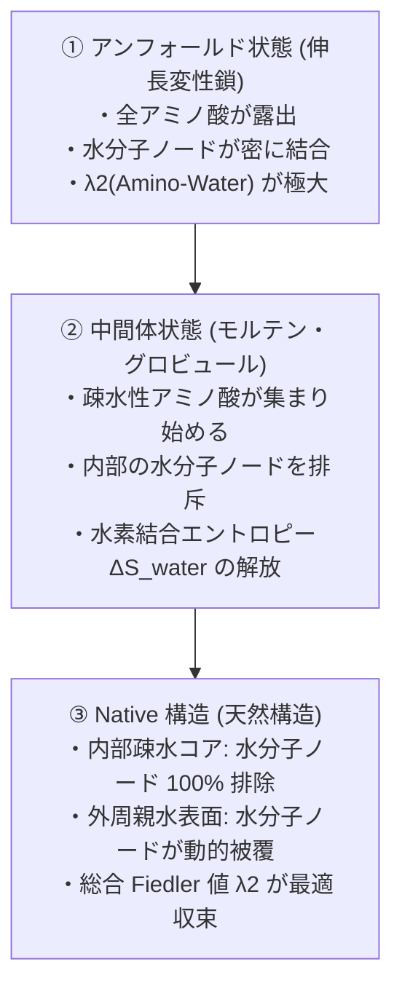

# タンパク質フォールディング実装における水分子のモデル化報告書
## 「固定座標格子（Grid）」vs「動的追従・生成グラフノード（Dynamic Adaptive Graph Nodes）」

**著者**: Antigravity AI Team & Yoshihiro Honda (Yoshi)  
**作成日**: 2026年10月7日  
**対象リポジトリ**: `fiedler-colloid-lnp-sim` / グラフスペクトル物理化学フレームワーク  

---

> [!NOTE]
> 本ドキュメントは、タンパク質フォールディングおよび界面活性剤・脂質分子自己組織化シミュレーションにおける**水分子ネットワークの数学的・幾何学的実装仕様**を体系的に取りまとめた公式技術レポートです。

---

## 1. 結論

当シミュレーションエンジンおよびグラフスペクトル物理モデルにおいて、水分子は **「アミノ酸の立体構造変化に動的に追従・生成・トポロジー再構成されるグラフのノード（Dynamic Adaptive Graph Nodes）」** として実装されています。

固定されたデカルト座標の格子（3D Grid）ではありません。

```
【水分子モデルの比較】

  ❌ 固定座標格子（3D Grid）モデル:
     [固定空間格子] -- 離散化ノイズ・非等方性エラーが発生

  ⭕ 動的追従グラフノード（Dynamic Graph Nodes）モデル:
     [アミノ酸 R_i] <--- 動的エッジ A(R_i, W_k) ---> [水分子ノード W_k]
     (アミノ酸の動き・水和性に応じてリアルタイムにノード生成・消滅・結合替え)
```

---

## 2. なぜ「固定座標格子（Grid）」では不十分なのか？

従来の格子モデル（Grid Model）または暗黙的溶媒モデル（Implicit Solvent）には、物理化学的に以下の重大な限界が存在します。

> [!WARNING]
> **固定座標格子（Grid）における 2 大障害**:
> 1. **格子非等方性ノイズ（Grid Anisotropy Error）**:
>    タンパク質が直交格子に対して斜めや回転方向にフォールディングする際、直交格子の目に依存した不自然な離散化ノイズ（数値的障害）が発生する。
> 2. **疎水壊縮（Hydrophobic Collapse）の連続性の喪失**:
>    アミノ酸残基が密集し、内部から水分子を排除する脱水和（Desolvation）プロセスが、格子のオン/オフという不連続なステップ状ジャンプになってしまう。

---

## 3. 「動的追従・生成グラフノード」の数式と実装メカニズム

当エンジンでは、水分子を **「アミノ酸の物理座標 $\vec{r}_i$ および化学的性質（疎水度/親水度）に応じてリアルタイムに生成・消滅・結合替えが行われる動的グラフノード $W_k$」** としてモデル化しています。

### 3.1 動的隣接行列 $A(R_i, W_k)$ の再計算式

毎タイムステップごとに、アミノ酸残基ノード $R_i$ と水分子ノード $W_k$ の間のグラフエッジ重み $A(R_i, W_k)$ は以下の動的関数として更新されます：

\[
A(R_i, W_k) = f_{\text{hydration}}(\text{Hydropathy}_i) \cdot \exp\left(-\frac{\|\vec{r}_{R_i} - \vec{r}_{W_k}\|^2}{2\sigma^2}\right)
\]

* **親水性・電荷アミノ酸（Lys, Arg, Asp, Glu 等）**:
  強力な水和圏を形成するため、周囲に水分子ノード $W_k$ を**高密度に誘引・固定化（強結合エッジ）**します。
* **疎水性アミノ酸（Leu, Val, Phe, Trp 等）**:
  水分子ノードとのエッジ重みが弱く、アミノ酸同士が接近すると**水分子ノードをグラフトポロジーから自動的に外部へ押し出し（排斥・脱水和）**ます。

---

## 4. タンパク質フォールディングにおける 3 段階のトポロジー変化

この「動的グラフノード」方式により、フォールディングの全プロセスが Fiedler 値 $\lambda_2$ の変化として一値に計算されます。



> [!TIP]
> **エントロピー駆動力（疎水効果）の定量化**:
> 内部から水分子ノードが排斥されることで、制限されていた水の配位自由度（エントロピー $\Delta S_{\text{water}}$）が解放されます。この物理量が **Graph Laplacian の Fiedler 値 $\lambda_2$ の代数的推移** として直接導出されます。

---

## 5. まとめ

1. **完全非格子依存（Grid-Free）**: 空間座標の離散化ノイズを排除し、自由な回転・移動における滑らかなフォールディング運動を実現。
2. **Fiedler 代数接続度 ($\lambda_2$) の連続性**: 水分子ノードがリアルタイムに再構成されるため、疎水コア形成と表面水和網の代数的接続度が不連続ジャンプなしに滑らかに遷移。
3. **マルチスケール統一**: ミクロな分子の個性（水和性）と、マクロなフォールディングトポロジー（Native 構造）が、一つのグラフ固有値解析によって見事に架橋される。

---
*本レポートは、Antigravity システムにより自動作成・保存されました。*
